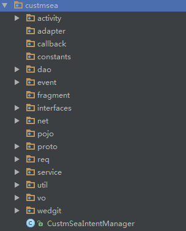

# 新人入门指南-网络接口篇

---

## 前言
本文主要针对MOA项目中设计和编码网络接口时的一些，刍荛之见，如读者思考或描述偶有欠妥，万望修改或备注意见，为后来者提供更好的入手姿势。

## 目录的介绍

现在的项目按不同的功能进行了分包，每个功能包下面都有几乎相似的目录结构，如下图所示：



其中，与接口相关的有如下几个包：
- service ： 存放网络接口类的包，主要功能是为UI层提供网络和本地接口。
- callback ： 存放callback的包，主要功能是抽取出来的一个Callback方法，用来处理复杂的网络返回结果。
- dao ： 存放与数据库操作相关的方法和接口，主要功能是为网络层提供数据库操作的接口。
- pojo ： 存放网络接口使用的实体类，该包下的类，一般情况下是用来对PB文件进行转换或者对PB的泛型重新定义的类。
- vo ： 存放UI层直接使用的实体类，该包下的类是对pojo下的类进行再次处理后能够直接被UI层使用的类
- net : 存放的旧版本时代的历史接口方法，如果有时间和勇气，请修改西面的方法，转移到service下面

对于这些包的分工及使用有如下几点建议：
1. dao和service下面仅存放接口类和相关的抽象方法，不要再存放其它的类
2. 不是所有的Callback都需要被抽离出来作为一个单独的类，只有在网络接口返回的数据过于复杂，需要进行特殊处理时才抽离
3. pojo和vo下都存储的是UI层可以直接使用的数据，不需要为了保证UI层使用的是vo类，刻意写一个一模一样的类
4. PB转pojo和pojo转vo的方法最好作为静态方法写在目标类中，不要抽离出去，不方便维护（老代码很多都是抽离出去的）

## 准备工作

首先，我们需要知道服务器的两个项目的svn地址：

- 请求码：svn://200.200.107.201/moa/moa/moa1.1/Trunk/background/env/source/libs/moabase/include

- PB类：svn://200.200.107.201/moa/moa/moa1.1/Trunk/proto/proto_def

### <span id = "span_code">请求码

请求码的项目下面都是“.h”文件，这个项目下面是服务器使用到的一些“头文件”，我们需要关注其中的两个文件：
- moa_typedef.h ： 这个下面存放了我们客户端所有网络请求的服务码和操作码，分别对应MOA项目下面的**NetServices.java**和**NetOperations.java**
- moa_errno.h ： 这个下面存放了我们客户端所有网络返回的错误码，对应MOA项目下面的**NetError.java**

> **排坑指南：**
> 1.这两个文件你得经常自己去更新，然后修改对应的类，服务器不会告诉你这个类有更新，不要祈求服务端在文件有更新时通知你！
>
> 2.有些服务码是App用不到的，你可以不加进去，但是如果有请求的REQ码，RSP的码也必须得放进去，即时没用到！

### <span id = "span_pb">PB类

PB类的项目下面的“.proto”文件，就是借口的REQ和RSP的详细信息，我们对于这类文件的操作一般有两种方法，在不同的场景，我们对于这类文件的操作一般不同，你可以选择你喜欢的方式。

- 第一种方法，一般用在不熟悉proto文件时，我们会使用[工具](file:\\200.200.107.38\software\Android\wire1.2)帮我们将proto文件转换成java文件，然后使用生成的新的PB类覆盖jni下面相同命名的PB类，达到更新的目的
- 第二种方法，在熟悉了proto文件后，我们可以根据SVN的提交记录找到有变化的proto文件以及其中的PB类，然后在jni下面对应的PB类中进行对应的修改

>**排坑指南：**
>1.使用第一种方法时要注意如下几点：
>  - 工具生成的代码注释会出现换行的情况，暂时没办法解决~
>  - 需要自己修改proto文件中的packet内容，否则生成的Java文件不能直接在jni的库中使用，正确命名是jni库中的包名
>  - proto中如果import的其它的文件，需要把对应文件的packet也修改成正确包名
>
>2.使用第二种方法时要注意的只有一个地方：千万别看漏了！千万别看漏了！千万别看漏了！（重要的事说三遍！）
>
>3.推荐新人靠第一种方法熟悉接口文件，然后培养自己使用第二种方法，可以减少很多时间

## 开发接口

在开发过程中，你将看到项目中有很多种接口的编码模式，最常见的就是使用 NetTask 或者各种 Template。NetTask 是当前最新的接口实现方式，它的优点有很多：

- 减少了接口代码的数量
- 提高了接口代码的可读性
- 内部封装了同步和异步的实现，调用简单
- 内部打印错误及正确的网络返回信息

### NetTask 的使用
下面是使用伪码描述的一个 NetTask 的使用方法：
```java

	new NetTask<PB请求类,PB返回类>(接口方法名)
	.buildPbReq(new NetTask.PbBuild<PB_Req>() {
		@Override
        public PB请求类 buildPbReq() {
			//初始化 PB请求类
            return req;
        }
	})
	.request(服务码, 操作码, PB返回类)
	.handleError(new NetTask.ErrorHandle<PB返回类>() {
        @Override
        public void handle(Integer errorCode, PB返回类 PB返回类, Callback callback) {
            //处理错误返回结果
        }
    })
    .handleSuccess(new NetTask.SuccessHandle<PB_Rsp>() {
        @Override
        public Object handle(PB返回类 pbRsp, Object lastHandleReturn, Callback cb) {
            //处理正确返回结果
            return null;
        }
    })
    .run(callback，是否同步);

```
针对上面的伪码中使用到的一些参数，需要注意：

> **排坑指南：**
> 1.PB请求类和PB返回类是通过proto文件和对应的工具生成前文已经提到过（[点击查看](#span_pb)）
> 2.服务码和操作码的获取及它在项目中对应的类之前也提到过（[点击查看](#span_code)）
> 3.接口方法名不是网络请求的名字，而是在你的Service类中使用这个 NetTask 的方法名
> 4.当你调用了 handleError 或 handleSuccess 的方法后，必须在Handle 方法中执行 callback 的回调
> 5.当你传入的 callback=null 时，必须调用 handleError 和 handleSuccess 来处理异常和正常情况
> 6.run 方法存在多个实现，分别对应同步、异步的请求方式，可以看看具体的代码和注释
> 7.<>括号中的PB是直接使用的PB类，request中的PB使用的是PB类的Class

### NetTask 的流程
下面是 NetTask 的执行流程：

<iframe id="embed_dom" name="embed_dom" frameborder="1" style="display:block;width:1080px; height:720px;" src="https://www.processon.com/embed/59813adae4b06886663b0d94"></iframe>


结合伪码和流程图可以看出，使用 NetTask 包装好的方法来构建网络接口，其流程结构非常的简单，上层在创建一个网络请求的时候，根本就不用去关心请求是如何发出去的，也不用去关心打印日志等一些问题。

### NetTask 实例
```java

\\例子一：异步请求
    public static void saveRemindShareMsg(final ShareMsg msgVo, final Callback callback) {
        new NetTask<PB_SdRemindSaveMsgReq, PB_SdRemindSaveMsgRsp>("saveRemindShareMsg")
                .buildPbReq(new NetTask.PbBuild<PB_SdRemindSaveMsgReq>() {
                    @Override
                    public PB_SdRemindSaveMsgReq buildPbReq() {
                        PB_SdRemindSaveMsgReq req = new PB_SdRemindSaveMsgReq();
                        req.msg_info = ShareMsg.poToPb(msgVo);
                        return req;
                    }
                })
                .request(NetServices.SERVER_SCHEDULE, NetOperations.SRVOP_SCHEDULE_REMIND_SAVE_MSG_REQ, PB_SdRemindSaveMsgRsp.class)
                .handleSuccess(new NetTask.SuccessHandle<PB_SdRemindSaveMsgRsp>() {
                    @Override
                    public Object handle(PB_SdRemindSaveMsgRsp pbRsp, Object lastHandleReturn, Callback cb) {
                        CallbackUtils.callbackInfoVoid(callback);
                        return null;
                    }
                })
                .runOnThread(callback);
    }

\\例子二：同步请求
    public static StandardEntityResult<ScheduleVo> getScheduleDetailNet(long sid) {

        final List<Long> sids = new ArrayList<>();
        sids.add(sid);

        final StandardEntityResult<ScheduleVo> backInfo = new StandardEntityResult<>();

        final ScheduleGetSpecifiedCallback getCallback = new ScheduleGetSpecifiedCallback(new Callback() {
            @Override
            public <T> void callback(CallbackInfo<T> info) {
                if (info.bError) {
                    backInfo.bError = true;
                    backInfo.errorCode = info.errorCode;
                } else {
                    backInfo.bError = false;
                    List<ScheduleVo> infos = (List<ScheduleVo>) info.mTs;
                    backInfo.entity = infos != null && infos.size() > 0 ? infos.get(0) : null;
                }
            }
        }, sids);
        new NetTask<PB_SdGetReq, PB_SdGetRsp>("getScheduleDetailNet")
                .buildPbReq(new NetTask.PbBuild<PB_SdGetReq>() {
                    @Override
                    public PB_SdGetReq buildPbReq() {
                        PB_SdGetReq req = new PB_SdGetReq();
                        List<Schedule> schedules = null;
                        try {
                            schedules = ScheduleDaoImpl.dao.queryVersion(sids);
                        } catch (SQLException e) {
                            e.printStackTrace();
                            LogCore.i(TAG, e);
                        }
                        req.sd_vers = ScheduleEntityTransform.idVersionsToPbIdVers(ScheduleEntityTransform.schedulesToIdViersions(schedules, sids));
                        return req;
                    }
                })
                .request(NetServices.SERVER_SCHEDULE, NetOperations.SRVOP_SCHEDULE_GET_REQ, PB_SdGetRsp.class)
                .handleSuccess(new NetTask.SuccessHandle<PB_SdGetRsp>() {
                    @Override
                    public Object handle(PB_SdGetRsp pbRsp, Object lastHandleReturn, Callback callback) {
                        CallbackUtils.callbackInfoObject(getCallback, pbRsp);
                        return null;
                    }
                })
                .run(getCallback);
        return backInfo;
    }

```
